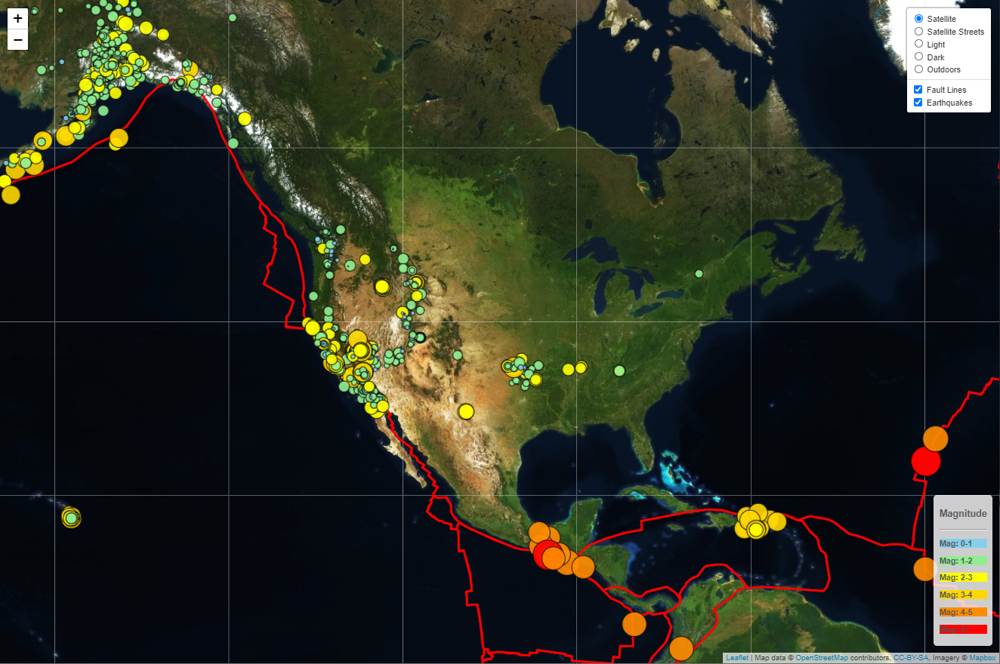
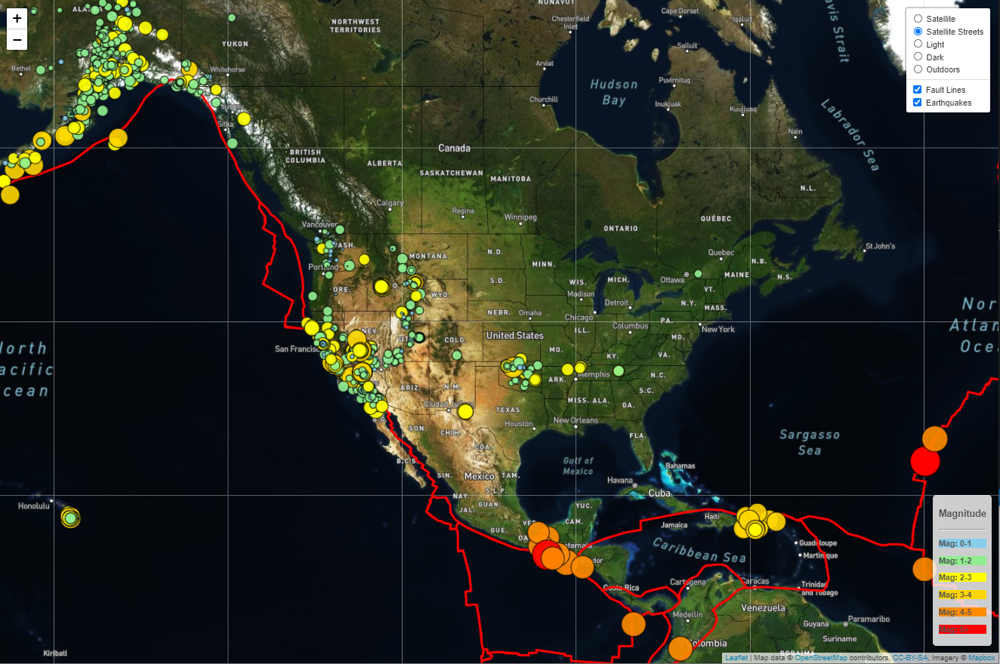
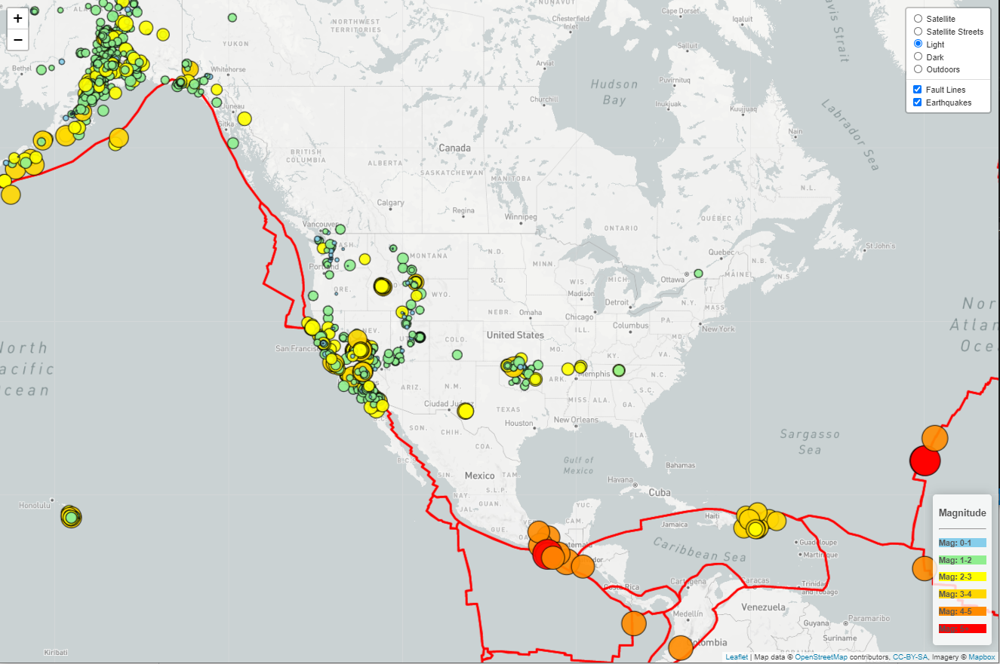
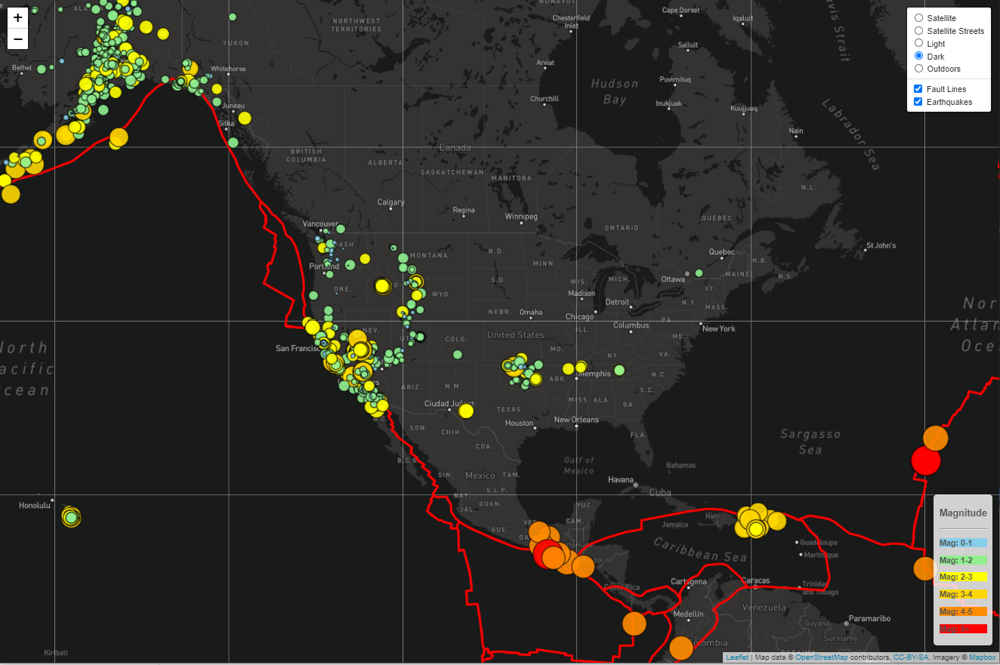
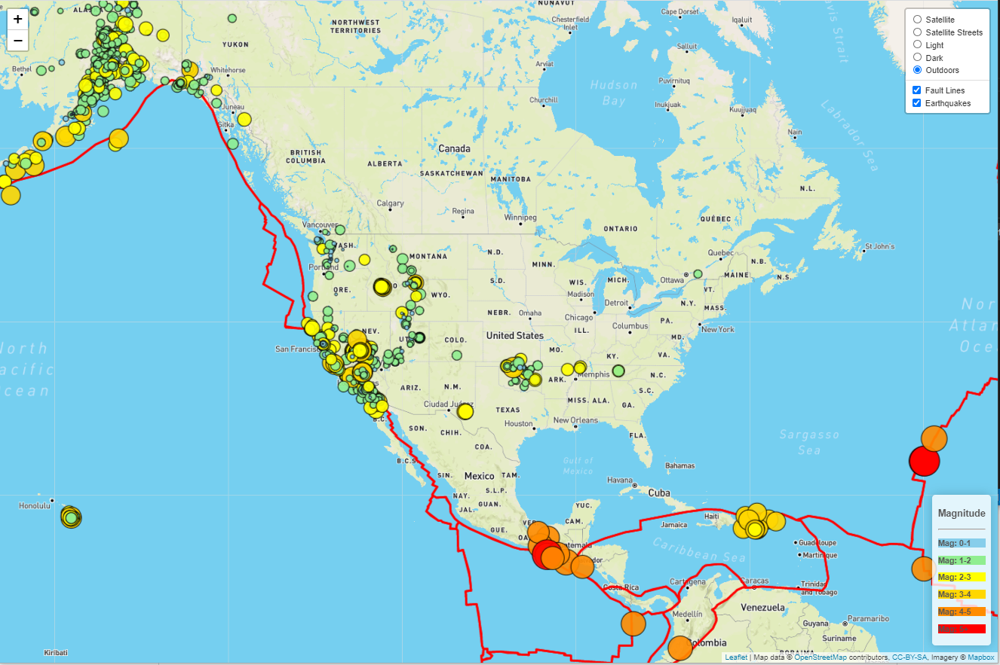

# Leaflet Challenge: 

## This repository contains the folders and files regarding a Leaflet exercise that was performed with data related to earthquakes and fault lines. 
The data related to earthquakes was obtained from the following website hosted by the United States Geological Survey:
 
https://earthquake.usgs.gov/earthquakes/feed/v1.0/geojson.php
 
The United States Geological Survey, or USGS is responsible for providing scientific data about natural hazards, the health of our ecosystems and environment; and the impacts of climate and land-use change. Their scientists develop new methods and tools to supply timely, relevant, and useful information about the Earth and its processes.
 
 
The data related to fault lines was obtained from the following website:
 
https://github.com/fraxen/tectonicplates
 
 

### Files and Folder Structure:
This repository contains the following:
1.	An HTML file called "index" which is the file used for the webpage.
2.  A folder called "data" that contains a file called PB2002_plates. This file contains the data related to the fault lines. 
3.  A folder called images. This folder contains images of the different views of the final webpage.
4.  A folder called "static". 
This folder contains the following subfolders:
* - css: This folder contains a file related to styling / formatting.
* - Js: This folder contains the main javascript file called “app” that is used in the index.html file.
 
 

### Webpage Details:
We were asked to build a webpage that to help visualize the earthquake data provided by the USGS. 
 
We used the leaflet javascript library in combination with HTML and CSS to build the webpage.
 
We selected 5 "basemap" layouts (provided by MapBox) as follows:
1. Satellite:
This basemap is a Satellite view of Earth.
2. Satellite-Streets:
This basemap is a Satellite view of Earth along with street level information.
3. Light:
This basemap is a "gray-scale" view of Earth.
4. Dark:
This basemap is like an "evening/night" view of Earth. 
5. Outdoors:
This basemap is like a "day-time" view of Earth. 
 
We have added two informational layers onto the basemap. These layers are called the "overlay layers. 
 
They are as follows:
 
1. Fault Lines:
This plots the fault lines as a red lien on whichever basemap is selected by the user.
 
2. Earthquakes:
This plots the earthquakes aa different colored circles on whichever basemap is selected by the user. The larger the size of the circle, the greater the magnitude of the earthquake. 
 
 
We assigned different colors to the circles to represent the different earthquake magnitudes as follows:
 
1. Magnitude 0-1: Sky-Blue
 
2. Magnitude 1-2: Light-Green
 
3. Magnitude 2-3: Yellow
 
4. Magnitude 3-4: Gold
 
5. Magnitude 4-5: Dark-Orange
 
6. Magnitude >5: Red
 
 
At the top right hand corner of the webpage there is a rectangular box known as the "controls box". 
 
The top section of the controls box allows a user to select any of these 5 basemaps by clicking on the radio button right next to the desired basemap.
 
The bottom section of the controls box allows a user to select either the "Fault Lines" option, or the "Earthquakes" option, or even a combination of both the options.
 
 

### Webpage Images:
This is an image of the default map when the webpage is launched. 
The Basemap is a Satellite View of the Earth.
On this Basemap we have plotted the fault lines (represented by the red line) and the magnitudes of the earthquakes (represented by the different colored circles):
 
 

 
 
If the user selects the Baasemap called "Satellite-Streets" (and leaves the fault lines and earthquake options checked), then the webpage will look as follows:
 
 

 
 
If the user selects the Baasemap called "Light" (and leaves the fault lines and earthquake options checked), then the webpage will look as follows:
 
 

 
 
If the user selects the Baasemap called "Dark" (and leaves the fault lines and earthquake options checked), then the webpage will look as follows:
 
 

If the user selects the Baasemap called "Outdoors" (and leaves the fault lines and earthquake options checked), then the webpage will look as follows:
 
 

## Additional Information: 
### Major Earthquakes in History:
The following website lists the top 10 deadliest earthquakes in history:
https://www.britannica.com/science/earthquake-geology/Major-historical-earthquakes

 

## Additional Information: 
### Important Earthquake Safety Precautions:
The following website contains useful information regarding the steps that can be taken to be prepared to survive and recover from an  earthquake.
https://www.earthquakeauthority.com/California-Earthquake-Risk/Personal-Preparedness/Seven-Steps-to-Earthquake-Safety

